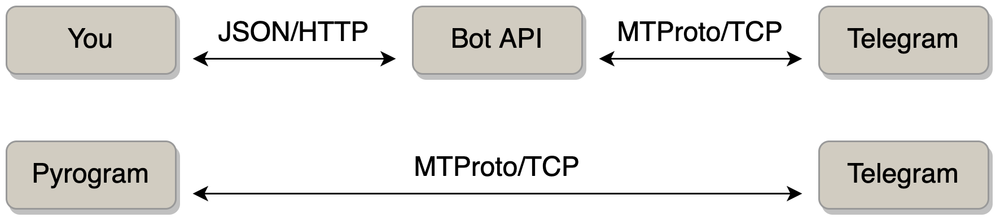

## Смотрим HTTP трафик

```bash
# установка wireshark
$ sudo apt install wireshark
$ sudo dpkg-reconfigure wireshark-common
$ sudo chmod +x /usr/bin/dumpcap

# запускаем wireshark
$ wireshark

# запускаем HTTP сервер
$ python3 http-server.py

# отправляем HTTP запрос
$ curl "http://127.0.0.1:8000?login=user&password=passwd"
```

## Смотрим HTTPS трафик

```bash
# Генерируем самоподписанный ключ и сертификат
$ openssl req -newkey rsa:2048 -nodes -keyout key.pem -x509 -days 365 -out cert.pem

# запускаем HTTPS сервер
$ python3 https-server.py

# отправляем HTTPS запрос
$ curl https://127.0.0.1:8443

# отправляем HTTPS запрос (разрешаем самоподписанный сертификат)
$ curl --insecure "https://127.0.0.1:8443?login=user&password=passwd"
```

В каждом запросе в телеграмм используется секретный access token прямо. Это можно делать только в HTTPS!

## Ссылки
https://www.cloudflare.com/learning/ssl/why-is-http-not-secure/


## JSON

JavaScript Object Notation
- human-readable
- https://docs.python.org/3/library/json.html
- https://jsonpath.com


# Введение в телеграм боты

https://core.telegram.org/mtproto

HTTP Bot API vs MTProto


https://docs.telethon.dev/en/stable/concepts/botapi-vs-mtproto.html
https://docs.pyrogram.org/faq/why-is-the-api-key-needed-for-bots


https://core.telegram.org/bots
https://core.telegram.org/bots/api

1. Бот - это особоый вид пользователья телеграмм.
2. Создается только через BotFather.
3. Не может написать первым (чтобы избежать спама)
4. За логику бота отвечает пользовательская программа, которая общается с Bot API по HTTPS протоколу.


Authorizing your bot

Making requests

Getting updates: long pooling / webhooks

Чтобы бот отправил бот сообщение пользователю - просто вызываем метод sendMessage

Отправляем сообщение

Получаем сообщения при помощи getUpdates. Исследуем как отметить сообение прочитанным!

Работаем сначала на голых curl запросах.

Заготовка бота https://github.com/dinara-urazova/arithmetic_bot/blob/main/bot/__main__.py