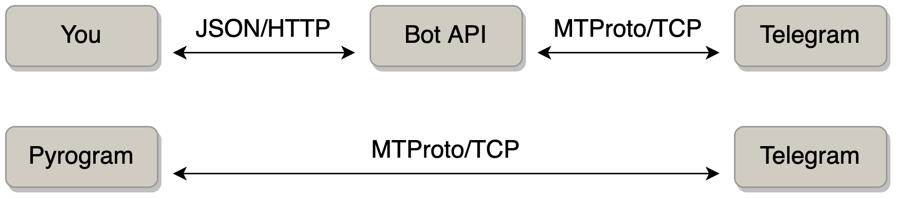

# Введение в телеграм боты

https://core.telegram.org/mtproto

HTTP Bot API vs MTProto

https://docs.telethon.dev/en/stable/concepts/botapi-vs-mtproto.html
https://docs.pyrogram.org/faq/why-is-the-api-key-needed-for-bots

https://core.telegram.org/bots
https://core.telegram.org/bots/api

1. Бот — это особый вид пользователя Telegram.
1. Создается только через https://t.me/BotFather
1. Не может написать первым (уважает приватность пользователей, так Bot API избегает спама)
1. За логику бота отвечает пользовательская программа, которая общается с Bot API по HTTPS протоколу.

Authorizing your bot

Making requests

Getting updates: long pooling / webhooks

Чтобы бот отправил бот сообщение пользователю - просто вызываем метод sendMessage

Отправляем сообщение

Получаем сообщения при помощи getUpdates. Исследуем как отметить сообщение прочитанным!

Работаем сначала на голых curl запросах.

Заготовка бота https://github.com/dinara-urazova/arithmetic_bot/blob/main/bot/__main__.py